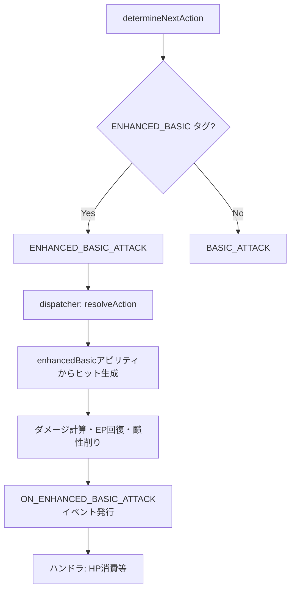
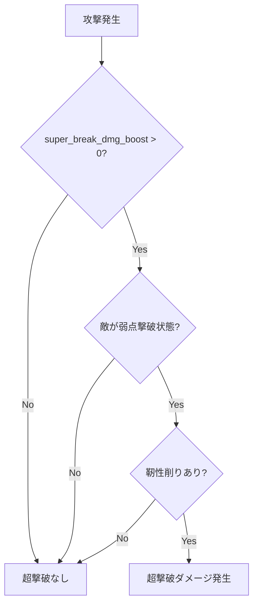
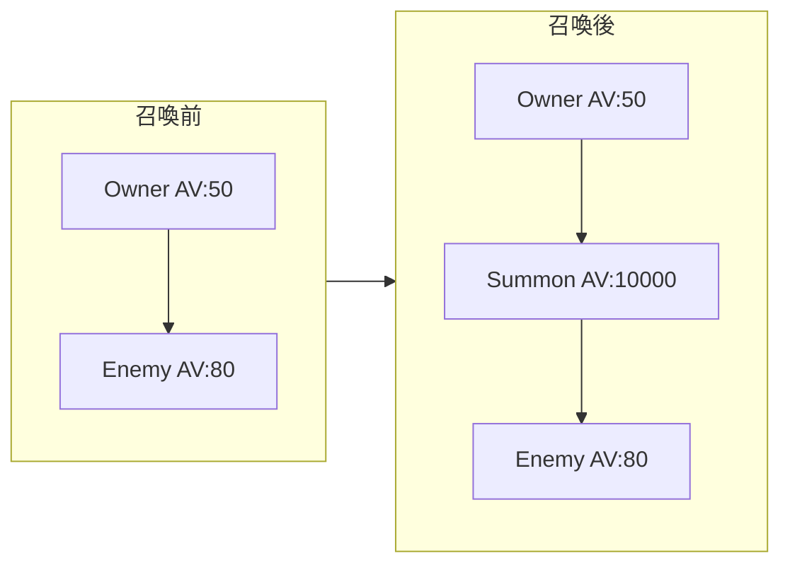

# キャラクター実装リファレンス

このドキュメントは、新しいキャラクターを実装する際に使用すべき汎用関数とデータ構造をまとめたものです。

---

## 目次
1. [ファイル構造](#ファイル構造)
2. [必須インポート](#必須インポート)
3. [定数定義](#定数定義)
4. [星魂レベル対応パターン](#星魂レベル対応パターンe3e5)
5. [データ構造](#データ構造)
6. [汎用関数](#汎用関数)
7. [イベントタイプ](#イベントタイプ)
8. [ハンドラー実装パターン](#ハンドラー実装パターン)
9. [エフェクト作成パターン](#エフェクト作成パターン)


---

## ファイル構造

```
app/data/characters/[character-name].ts
├── インポート
├── 定数定義
├── キャラクター定義 (export const characterName: Character)
├── ヘルパー関数 (private)
└── ハンドラーファクトリ (export const characterNameHandlerFactory)
```

---

## 必須インポート

```typescript
// 基本型
import { Character, Element, Path, StatKey } from '../../types/index';
import { IEventHandlerFactory, GameState, IEvent, Unit } from '../../simulator/engine/types';
import { IEffect } from '../../simulator/effect/types';

// エフェクト管理
import { addEffect, removeEffect } from '../../simulator/engine/effectManager';

// ユーティリティ関数
import { applyHealing, cleanse, applyShield, advanceAction } from '../../simulator/engine/utils';

// ダメージ計算
import { applyUnifiedDamage } from '../../simulator/engine/dispatcher';
import { calculateHeal, calculateNormalAdditionalDamage } from '../../simulator/damage';

// SP操作（必要な場合）
import { addSkillPoints } from '../../simulator/effect/relicEffectHelpers';
```

---

## 定数定義

ファイル冒頭でマジックナンバーを定数として定義します。

```typescript
// --- 定数定義 ---
const CHARACTER_ID = 'character-name';

// 通常攻撃
const BASIC_MULT = 1.0;

// スキル
const SKILL_MULT = 2.0;
const SKILL_DURATION = 3;

// 必殺技
const ULT_MULT = 3.0;

// 天賦
const TALENT_MULT = 1.5;

// 秘技
const TECHNIQUE_MULT = 2.0;

// 星魂
const E1_BONUS = 0.20;
const E2_VALUE = 0.30;
// ...

// 軌跡
const TRACE_A2_VALUE = 0.10;
```

---

## 星魂レベル対応パターン（E3/E5）

星魂E3およびE5ではアビリティレベルが上昇します。キャラクターによってパターンが異なるため、直接判定方式を採用しています。

### E3/E5パターン一覧

| パターン | E3 | E5 | 該当キャラ |
|---------|----|----|-----------|
| **標準** | スキル+2, 通常+1 | 必殺技+2, 天賦+2 | 大半のキャラ |
| **非標準A** | 必殺技+2, 通常+1 | スキル+2, 天賦+2 | Tribbie, Hianshi |

### 実装方法

#### 1. インポート
```typescript
import { getLeveledValue } from '../../simulator/utils/abilityLevel';
```

#### 2. ABILITY_VALUES定義
```typescript
// --- E3/E5パターン ---
// E3: スキルLv+2, 通常Lv+1
// E5: 必殺技Lv+2, 天賦Lv+2

// --- アビリティ値 (レベル別) ---
const ABILITY_VALUES = {
    // スキル回復: E3でLv12に上昇
    skillHeal: {
        10: { mult: 0.60, flat: 800 },
        12: { mult: 0.64, flat: 890 }
    } as Record<number, { mult: number; flat: number }>,
    
    // 天賦バリア: E5でLv12に上昇
    talentBarrier: {
        10: { pct: 0.10, flat: 200 },
        12: { pct: 0.106, flat: 222.5 }
    } as Record<number, { pct: number; flat: number }>,
};
```

#### 3. ハンドラー内での使用（標準パターン）
```typescript
// E3: スキルLv+2
const skillLevel = (source.eidolonLevel || 0) >= 3 ? 12 : 10;
const skillHeal = getLeveledValue(ABILITY_VALUES.skillHeal, skillLevel);
const healAmount = skillHeal.mult * source.stats.atk + skillHeal.flat;

// E5: 必殺技Lv+2, 天賦Lv+2
const ultLevel = (source.eidolonLevel || 0) >= 5 ? 12 : 10;
const ultDamage = getLeveledValue(ABILITY_VALUES.ultDamage, ultLevel);
```

#### 4. 非標準パターン（Hianshi等）
```typescript
// --- E3/E5パターン (非標準) ---
// E3: 必殺技Lv+2, 通常Lv+1 → 必殺技回復がLv12
// E5: スキルLv+2, 天賦Lv+2 → スキル回復がLv12

// E3: 必殺技Lv+2 (非標準)
const ultLevel = (source.eidolonLevel || 0) >= 3 ? 12 : 10;

// E5: スキルLv+2 (非標準)
const skillLevel = (source.eidolonLevel || 0) >= 5 ? 12 : 10;
```

### 注意点
- **仕様書を必ず確認**: キャラクターごとにE3/E5パターンが異なる
- **コメントを残す**: E3/E5パターンをファイル冒頭にコメントで明記
- **ダメージ倍率はabilityModifiers**: ダメージ倍率はCharacter.eidolons.e3/e5.abilityModifiersで上書き

---

## データ構造

### Unit（ユニット）
```typescript
interface Unit {
    id: string;              // 一意ID
    name: string;            // 表示名
    isEnemy: boolean;        // 敵かどうか
    element: Element;        // 属性
    level: number;           // レベル
    eidolonLevel?: number;   // 星魂レベル（0-6）
    hp: number;              // 現在HP
    ep: number;              // 現在EP
    shield: number;          // 現在シールド
    stats: FinalStats;       // 最終ステータス
    effects: IEffect[];      // 付与されているエフェクト
    modifiers: Modifier[];   // ステータス修正
    abilities: Character['abilities'];  // アビリティ定義
    traces?: Character['traces'];       // 軌跡
}
```

### IEffect（エフェクト）
```typescript
interface IEffect {
    id: string;                    // 一意ID（必須）
    name: string;                  // 表示名（必須）
    category: 'BUFF' | 'DEBUFF' | 'STATUS';  // カテゴリ（必須）
    sourceUnitId: string;          // 発生源のユニットID（必須）
    
    // 持続時間
    durationType: 'PERMANENT' | 'TURN_START_BASED' | 'TURN_END_BASED' | 'LINKED';
    duration: number;              // ターン数（PERMANENTは-1）
    
    // スタック
    stackCount?: number;
    maxStacks?: number;
    
    // 獲得ターン減少スキップ（TURN_END_BASED専用）
    // 注意: TURN_START_BASEDでは不要（後述）
    skipFirstTurnDecrement?: boolean;  // trueの場合、獲得ターンは減少しない
    appliedDuringTurnOf?: string;      // 付与時のターン所有者（自動設定）
    
    // リンク（親エフェクト削除時に自動削除）
    linkedEffectId?: string;
    
    // 固定確率（効果命中/効果抵抗を無視）
    ignoreResistance?: boolean;
    
    // 解除可能フラグ（明示的にtrueの場合のみ解除可能）
    isDispellable?: boolean;  // バフ解除（dispel）対象か
    isCleansable?: boolean;   // デバフ解除（cleanse）対象か
    
    // ステータス修正
    modifiers?: Modifier[];
    
    // ライフサイクルフック
    onApply?: (target: Unit, state: GameState) => GameState;
    onRemove?: (target: Unit, state: GameState) => GameState;
    onTick?: (target: Unit, state: GameState) => GameState;
    
    // 必須フック（レガシー）
    apply: (t: Unit, s: GameState) => s;
    remove: (t: Unit, s: GameState) => s;
    
    // タグ
    tags?: string[];  // 例: 'PREVENT_TURN_END', 'LUOCHA_FIELD'
}
```

#### durationTypeの動作

> [!IMPORTANT]
> **TURN_START_BASED vs TURN_END_BASED**

| タイプ | 減少タイミング | skipFirstTurnDecrementの用途 | 主な用途 |
|-------|---------------|---------------------------|---------|
| `TURN_START_BASED` | そのユニットの**ターン開始時** | **不要** | DoT、デバフ |
| `TURN_END_BASED` | そのユニットの**ターン終了時** | 必要な場合あり | バフ、シールド |
| `PERMANENT` | 減少しない | 不要 | パッシブ効果 |
| `LINKED` | 親エフェクト削除時 | 不要 | 連動バフ |

#### タイムライン図解

**TURN_END_BASED（duration: 2、skipFirstTurnDecrement: true）**

```mermaid
timeline
    title バフ付与者Aのターン
    Aのスキル発動 : バフ付与 duration=2
    Aのターン終了 : skipFirstTurnDecrement=true なので減少なし
    
timeline
    title バフ付与者Aの次のターン
    Aのターン開始 : duration=2
    Aのターン終了 : duration=1 に減少
    
timeline
    title バフ付与者Aのさらに次のターン
    Aのターン開始 : duration=1
    Aのターン終了 : duration=0 → 効果終了
```

**TURN_START_BASED（duration: 2、燃焼など）**

```mermaid
timeline
    title デバフ付与者Aのターン
    Aの攻撃 : 燃焼付与 duration=2

timeline
    title デバフ対象Bの次のターン
    Bのターン開始 : 燃焼ダメージ発生 → duration=1 に減少
    
timeline
    title デバフ対象Bのさらに次のターン
    Bのターン開始 : 燃焼ダメージ発生 → duration=0 → 効果終了
```

#### なぜTURN_START_BASEDでは`skipFirstTurnDecrement`が不要か？

エフェクト付与は常に「ターン中」または「戦闘開始時」に行われます：
- 自身のスキルで付与 → 自分のターン**中**（開始時は既に過ぎている）
- 他キャラから付与 → 相手のターン**中**

どちらの場合も、付与時点では次のターン開始まで減少は発生しません。

#### TURN_END_BASEDで`skipFirstTurnDecrement`が必要な場合

自分のターン中に付与し、そのターン終了時に減少させたくない場合：

```typescript
// 三月なのかのカウンター付与
const shieldBuff: IEffect = {
    id: `march-counter-${targetId}`,
    name: 'カウンター準備',
    category: 'BUFF',
    sourceUnitId: sourceUnitId,
    durationType: 'TURN_END_BASED',
    skipFirstTurnDecrement: true,  // ← これがないと即座に減少してしまう
    duration: 1,
    // ...
};
```

#### ケーススタディ

| シナリオ | 推奨設定 | 理由 |
|----------|----------|------|
| **自己バフ（スキル使用後持続）** | `TURN_END_BASED` + `skipFirstTurnDecrement: true` | 付与ターンは減少させない |
| **他者付与バフ（サンデーのスキル）** | `TURN_END_BASED` + `skipFirstTurnDecrement: true` | 対象者のターン終了時に減少 |
| **DoT（燃焼、感電）** | `TURN_START_BASED` | 対象のターン開始時にダメージ→減少 |
| **デバフ（防御減少など）** | `TURN_START_BASED` | 対象のターン開始時に減少 |
| **永続バフ（パッシブ効果）** | `PERMANENT` | 減少しない |

> [!TIP]
> **判断のフローチャート**
> 1. 効果は永続か？ → `PERMANENT`
> 2. 対象のターン開始時に処理が必要か（DoT等）？ → `TURN_START_BASED`
> 3. それ以外（通常のバフ）→ `TURN_END_BASED` + `skipFirstTurnDecrement: true`


### GameState（ゲーム状態）
```typescript
interface GameState {
    units: Unit[];              // 全ユニット
    skillPoints: number;        // 現在SP
    maxSkillPoints: number;     // 最大SP（デフォルト5）
    time: number;               // 経過時間
    log: SimulationLogEntry[];  // ログ
    pendingActions: Action[];   // 保留アクション
    actionQueue: ActionQueueEntry[];  // 行動順
    result: BattleResult;       // 戦闘結果
}
```

---

## 汎用関数

### 回復
```typescript
import { applyHealing } from '../../simulator/engine/utils';

// 使用例
newState = applyHealing(
    state,           // 現在の状態
    sourceId,        // 回復源のID
    targetId,        // 対象のID
    healAmount,      // 回復量
    '回復の説明',     // ログ用説明（省略可）
    false            // ログスキップ（省略可）
);
```

### シールド付与
```typescript
import { applyShield } from '../../simulator/engine/utils';

// 使用例
newState = applyShield(
    state,
    sourceId,
    targetId,
    shieldValue,          // シールド量
    3,                    // 持続ターン
    'TURN_END_BASED',     // 'TURN_START_BASED' or 'TURN_END_BASED'
    'シールド名',          // 表示名
    'unique-shield-id',   // 一意ID（省略可）
    false                 // ログスキップ（省略可）
);
```

### デバフ解除
```typescript
import { cleanse } from '../../simulator/engine/utils';

// 使用例（最新のデバフを1つ解除）
newState = cleanse(state, targetId, 1);
```

### 行動順短縮
```typescript
import { advanceAction } from '../../simulator/engine/utils';

// 使用例（50%前進）
newState = advanceAction(state, unitId, 0.5, 'percent');

// 固定値で前進
newState = advanceAction(state, unitId, 100, 'fixed');
```

### 行動遅延
```typescript
import { delayAction } from '../../simulator/engine/utils';

// 使用例（30%遅延）
newState = delayAction(state, unitId, 0.3, 'percent');

// 固定値で遅延
newState = delayAction(state, unitId, 50, 'fixed');

// ログをスキップ
newState = delayAction(state, unitId, 0.2, 'percent', true);
```

### エフェクト追加/削除
```typescript
import { addEffect, removeEffect } from '../../simulator/engine/effectManager';

// 追加
newState = addEffect(state, targetId, effect);

// 削除
newState = removeEffect(state, targetId, effectId);
```

### ダメージ適用
```typescript
import { applyUnifiedDamage } from '../../simulator/engine/dispatcher';

// 使用例
const result = applyUnifiedDamage(
    state,
    sourceUnit,        // 攻撃者Unit
    targetUnit,        // 対象Unit
    damageAmount,      // ダメージ量
    {
        damageType: '付加ダメージ',  // ログ表示用
        details: '詳細説明',
        isKillRecoverEp: true,      // 撃破時EP回復
        skipLog: false,
        skipStats: false,
        events: []                   // 追加イベント
    }
);
newState = result.state;
const totalDamage = result.totalDamage;
const killed = result.killed;
```

### 回復量計算
```typescript
import { calculateHeal } from '../../simulator/damage';

const healAmount = calculateHeal(source, target, {
    scaling: 'atk',      // 'atk' or 'hp'
    multiplier: 0.60,    // 倍率
    flat: 800            // 固定値
});
```

### SP操作
```typescript
import { addSkillPoints } from '../../simulator/effect/relicEffectHelpers';

newState = addSkillPoints(state, 1);  // SP+1
```

### EP操作（エネルギー回復）
```typescript
import { addEnergyToUnit } from '../../simulator/engine/energy';

// 基本的なEP回復（ERR適用）
newState = addEnergyToUnit(state, unitId, 5);  // 基本5EP（ERR適用後）

// フラットEP回復（ERR非適用）
newState = addEnergyToUnit(state, unitId, 0, 30);  // 固定30EP

// ERRをスキップする場合（将来の一部効果用）
newState = addEnergyToUnit(state, unitId, 5, 0, true);  // skipERR=true
```

> [!IMPORTANT]
> **EP回復はaddEnergyToUnitを使用してください**
> - `baseEp`: ERR（エネルギー回復効率）が適用される
> - `flatEp`: ERRが適用されない固定値
> - インラインで`unit.ep += ...`と書かないこと

---

## イベントタイプ

ハンドラーが購読できるイベント一覧：

| イベント | 発火タイミング |
|---------|---------------|
| `ON_BATTLE_START` | 戦闘開始時 |
| `ON_TURN_START` | ターン開始時（`event.sourceId`でユニットを識別） |
| `ON_TURN_END` | ターン終了時 |
| `ON_BASIC_ATTACK` | 通常攻撃後 |
| `ON_ENHANCED_BASIC_ATTACK` | 強化通常攻撃後（刃の無間剣樹等） |
| `ON_SKILL_USED` | スキル使用後 |
| `ON_ULTIMATE_USED` | 必殺技使用後 |
| `ON_FOLLOW_UP_ATTACK` | 追加攻撃後 |
| `ON_ATTACK` | 全ての攻撃（通常/スキル/必殺技/追加攻撃）後 |
| `ON_DAMAGE_DEALT` | ダメージ発生時 |
| `ON_DOT_DAMAGE` | DoTダメージ発生時 |
| `ON_DEBUFF_APPLIED` | デバフ付与時 |
| `ON_EFFECT_APPLIED` | エフェクト付与時 |
| `ON_EFFECT_REMOVED` | エフェクト削除時 |
| `ON_UNIT_HEALED` | 回復時 |
| `ON_ENEMY_DEFEATED` | 敵撃破時 |
| `ON_ACTION_COMPLETE` | アクション完了時 |
| `ON_BEFORE_DAMAGE_CALCULATION` | ダメージ計算前（防御無視等の動的効果介入用） |
| `ON_SP_CHANGE` | SP増加時（`addSkillPoints`経由） |

---

## ハンドラー実装パターン

### 基本構造
```typescript
export const characterNameHandlerFactory: IEventHandlerFactory = (
    sourceUnitId,
    level: number,
    eidolonLevel: number = 0
) => {
    return {
        handlerMetadata: {
            id: `character-name-handler-${sourceUnitId}`,
            subscribesTo: [
                'ON_BATTLE_START',
                'ON_TURN_START',
                'ON_DAMAGE_DEALT',
                // 必要なイベントを追加
            ],
        },
        handlerLogic: (event: IEvent, state: GameState, handlerId: string): GameState => {
            const unit = state.units.find(u => u.id === sourceUnitId);
            if (!unit) return state;

            // イベントタイプ別に処理を分岐
            if (event.type === 'ON_BATTLE_START') {
                return onBattleStart(event, state, sourceUnitId, eidolonLevel);
            }

            if (event.type === 'ON_TURN_START') {
                return onTurnStart(event, state, sourceUnitId, eidolonLevel);
            }

            return state;
        }
    };
};
```

### 分離された関数パターン（推奨）
```typescript
// 戦闘開始時の処理
const onBattleStart = (
    event: IEvent,
    state: GameState,
    sourceUnitId: string,
    eidolonLevel: number
): GameState => {
    const unit = state.units.find(u => u.id === sourceUnitId);
    if (!unit) return state;

    let newState = state;

    // 秘技処理
    // ...

    // E1処理
    if (eidolonLevel >= 1) {
        // ...
    }

    return newState;
};
```

---

## エフェクト作成パターン

### バフ/デバフ
```typescript
const buff: IEffect = {
    id: `unique-buff-id-${sourceUnitId}`,
    name: 'バフ名',
    category: 'BUFF',
    sourceUnitId: sourceUnitId,
    durationType: 'TURN_END_BASED',
    skipFirstTurnDecrement: true,  // 獲得ターンは減少しない
    duration: 3,
    modifiers: [{
        source: 'バフ名',
        target: 'atk_pct' as StatKey,
        type: 'add',
        value: 0.20
    }],
    onApply: (t, s) => s,
    onRemove: (t, s) => s,
    apply: (t, s) => s,
    remove: (t, s) => s
};
newState = addEffect(newState, targetId, buff);
```

> [!IMPORTANT]
> **獲得ターン減少スキップ**: スタレの多くのバフは「獲得したターンのdurationは減少しない」仕様です。
> `skipFirstTurnDecrement: true` を設定すると、バフ所持者のターン中に獲得した場合、そのターン終了時の減少をスキップします。

### リンクエフェクト（親削除時に自動削除）
```typescript
const linkedBuff: IEffect = {
    id: `linked-buff-${targetId}`,
    name: 'リンクバフ',
    category: 'BUFF',
    sourceUnitId: sourceUnitId,
    durationType: 'LINKED',
    duration: 0,
    linkedEffectId: 'parent-effect-id',  // 親エフェクトのID
    onApply: (t, s) => { /* modifiers適用 */ },
    onRemove: (t, s) => { /* modifiers削除 */ },
    apply: (t, s) => s,
    remove: (t, s) => s
};
```

### スタック管理
```typescript
const stackEffect: IEffect = {
    id: `stack-effect-${sourceUnitId}`,
    name: 'スタックエフェクト',
    category: 'BUFF',
    sourceUnitId: sourceUnitId,
    durationType: 'PERMANENT',
    duration: -1,
    stackCount: 1,
    maxStacks: 3,
    apply: (t, s) => s,
    remove: (t, s) => s
};

// スタック更新
const existingEffect = unit.effects.find(e => e.id === stackEffect.id);
const newStackCount = Math.min(
    (existingEffect?.stackCount || 0) + 1,
    stackEffect.maxStacks!
);
```

---

## オーラシステム（フィールド上にいる間有効）

「キャラクターがフィールド上にいる間、味方全体に永続効果」を実装するパターンです。
ソースユニットが死亡すると自動的に効果が削除されます。

### 使用例
- カフカE2: 味方全体のDoT+33%
- サンデー: 味方全体のSPD+10%

### 実装方法

```typescript
import { IAura } from '../../simulator/engine/types';
import { addAura } from '../../simulator/engine/auraManager';

// 戦闘開始時にオーラを登録
if (event.type === 'ON_BATTLE_START') {
    if (eidolonLevel >= 2) {
        const e2Aura: IAura = {
            id: `character-e2-aura-${sourceUnitId}`,
            name: 'バフ名 (効果説明)',
            sourceUnitId: sourceUnitId,
            target: 'all_allies',  // 'all_allies' | 'all_enemies' | 'self' | 'other_allies'
            modifiers: [{
                target: 'dot_dmg_boost' as StatKey,
                value: 0.33,
                type: 'add',
                source: 'キャラE2'
            }]
        };
        newState = addAura(newState, e2Aura);
    }
}
```

> [!IMPORTANT]
> オーラはソースユニット死亡時に`applyUnifiedDamage`内で自動削除されます。
> ログにカーソルを合わせると `[オーラ] バフ名` として表示されます。

---

## 条件付きバフ（ON_BEFORE_DAMAGE_CALCULATION）

「特定の条件を満たす攻撃にのみ適用されるバフ」を実装するパターンです。
ダメージ計算直前に`damageModifiers`を変更することで実現します。

### 使用例
- ルアン・メェイE2: 弱点撃破状態の敵への攻撃時、ATK+40%

### 実装方法

```typescript
// 1. subscribesToにイベントを追加
subscribesTo: [
    'ON_BATTLE_START',
    'ON_BEFORE_DAMAGE_CALCULATION', // 追加
    // ...
],

// 2. ハンドラロジック
if (event.type === 'ON_BEFORE_DAMAGE_CALCULATION' && eidolonLevel >= 2 && event.targetId) {
    const target = newState.units.find(u => u.id === event.targetId);
    // 弱点撃破状態（toughness <= 0）の敵に対する攻撃の場合
    if (target && target.isEnemy && target.toughness <= 0) {
        newState = {
            ...newState,
            damageModifiers: {
                ...newState.damageModifiers,
                atkBoost: (newState.damageModifiers.atkBoost || 0) + 0.40
            }
        };
    }
    return newState;
}
```

### DamageCalculationModifiersの利用可能プロパティ

| プロパティ | 説明 |
|-----------|------|
| `defIgnore` | 防御無視 |
| `critRate` | 会心率バフ |
| `critDmg` | 会心ダメージバフ |
| `allTypeDmg` | 与ダメージバフ |
| `atkBoost` | ATKバフ（ATKスケーリング時のみ適用） |

---


刃のように「ある状態（バフ）が付与されているときに通常攻撃が強化版に置き換わる」仕組みを汎用的に実装しています。

### 該当キャラクター
- 刃（地獄変状態で無間剣樹）
- クラーラ（強化反撃）
- 景元（攻勢粿満タン時の強化通常）

### 実装方法

#### 1. キャラクター定義に `enhancedBasic` を追加
```typescript
abilities: {
    basic: { /* 通常通常攻撃 */ },
    skill: { ... },
    ultimate: { ... },
    talent: { ... },
    technique: { ... },
    
    // 強化通常攻撃
    enhancedBasic: {
        id: 'character-enhanced-basic',
        name: '強化通常攻撃名',
        type: 'Basic ATK',
        description: '強化通常の説明',
        damage: {
            type: 'blast',  // 例: 範囲攻撃
            scaling: 'hp',
            mainHits: [{ multiplier: 1.30, toughnessReduction: 15 }],
            adjacentHits: [{ multiplier: 0.52, toughnessReduction: 5 }],
        },
        energyGain: 30,
        targetType: 'blast',
    }
}
```

#### 2. 強化状態のバフにタグを追加
```typescript
const enhancedStateEffect: IEffect = {
    id: 'enhanced-state-effect',
    name: '強化状態名',
    category: 'BUFF',
    sourceUnitId: sourceUnitId,
    durationType: 'TURN_END_BASED',
    duration: 3,
    tags: [
        'SKILL_SILENCE',    // スキル使用不可（必要なら）
        'ENHANCED_BASIC'    // 強化通常攻撃を使用
    ],
    apply: (t, s) => s,
    remove: (t, s) => s
};
```

#### 3. ハンドラで強化通常固有の処理を実装
```typescript
// subscribesToにON_ENHANCED_BASIC_ATTACKを追加
subscribesTo: [
    'ON_ENHANCED_BASIC_ATTACK',
    // ...
]

// ハンドラ内
if (event.type === 'ON_ENHANCED_BASIC_ATTACK' && event.sourceId === sourceUnitId) {
    return onEnhancedBasicAttack(event, state, sourceUnitId, eidolonLevel);
}

// 強化通常攻撃固有処理（HP消費等）
const onEnhancedBasicAttack = (event, state, sourceUnitId, eidolonLevel) => {
    // ダメージ計算はパイプラインで自動処理
    // ここではHP消費、チャージ加算等の固有処理のみ
    let newState = state;
    newState = consumeHp(newState, sourceUnitId, 0.10, '強化通常');
    return newState;
};
```

### アーキテクチャ



### メリット
- ダメージ計算、EP回復、靧性削りはパイプラインで統一処理
- キャラクター固有ロジック（HP消費等）はハンドラで分離
- 将来のキャラクターにも同じ仕組みで対応可能

### 参考ファイル
- [blade.ts](file:///c:/soft/starrail_party_calc/app/data/characters/blade.ts) - 強化通常攻撃の実装例

## チェックリスト

新キャラクター実装時の確認項目：

### 1. ファイル作成
- [ ] `app/data/characters/[character-id].ts` を作成
- [ ] 定数定義（マジックナンバーを排除）
- [ ] キャラクター定義（abilities, traces, eidolons）
- [ ] ハンドラーファクトリ
- [ ] 秘技処理（ON_BATTLE_START）
- [ ] 天賦処理
- [ ] 星魂処理（E1〜E6）
- [ ] 軌跡処理
- [ ] ビルド確認（`npx tsc --noEmit`）

### 2. エクスポート追加
`app/data/characters/index.ts`:
```typescript
export { characterName, characterNameHandlerFactory } from './character-name';
// ... imports ...
import { characterName } from './character-name';
export const ALL_CHARACTERS = [..., characterName];
```

### 3. レジストリ登録
`app/simulator/registry/index.ts`:
```typescript
import { characterNameHandlerFactory } from '../../data/characters/character-name';
// ...
registry.registerCharacter('character-id', characterNameHandlerFactory);
```

### 4. 倍率検証チェックリスト

> [!IMPORTANT]
> **無凸基準で実装すること**: 仕様書に複数レベルの倍率が記載されている場合、**低い方（Lv6/Lv10）がデフォルト**です。

- [ ] 通常攻撃の倍率は**Lv6**基準か？（E5で+1されてLv7になる）
- [ ] スキルの倍率は**Lv10**基準か？（E3/E5でLv12になる）
- [ ] 必殺技の倍率は**Lv10**基準か？（E3/E5でLv12になる）
- [ ] 天賦の倍率は**Lv10**基準か？（E3/E5でLv12になる）
- [ ] E3/E5の`abilityModifiers`で正しいレベルの値が設定されているか？
- [ ] 仕様書の各レベル倍率と実装値が一致しているか？

---

## 追加：ターゲット選択パターン

ターゲット選択には `TargetSelector` クラスの使用を**推奨**します。

### TargetSelector の使用（推奨）

```typescript
import { TargetSelector } from '../../simulator/engine/selector';

const source = state.units.find(u => u.id === sourceUnitId)!;

// 敵全体を取得
const enemies = TargetSelector.select(source, state, { type: 'all_enemies' });

// 味方全体を取得
const allies = TargetSelector.select(source, state, { type: 'all_allies' });

// 最もHP割合が低い味方（回復対象選択など）
const lowestHpAlly = TargetSelector.select(source, state, {
    type: 'ally',
    sort: TargetSelector.SortByLowestHP
})[0];

// 最もATKが高い味方（バフ対象選択など）
const highestAtkAlly = TargetSelector.select(source, state, {
    type: 'ally',
    sort: TargetSelector.SortByHighestATK
})[0];

// ランダムな敵（1体）
const [randomEnemy] = TargetSelector.select(source, state, { 
    type: 'random_enemy', 
    count: 1 
});

// ランダムな敵（複数体、重複なし）
const randomEnemies = TargetSelector.select(source, state, { 
    type: 'random_enemy', 
    count: 3 
});

// 自分自身
const [self] = TargetSelector.select(source, state, { type: 'self' });

// カスタムフィルター: 特定のデバフを持つ敵のみ
const burnedEnemies = TargetSelector.select(source, state, {
    type: 'all_enemies',
    filter: (unit) => unit.effects.some(e => e.name === '燃焼')
});

// カスタムソート: HPが最も高い敵
const highestHpEnemy = TargetSelector.select(source, state, {
    type: 'single_enemy',
    sort: (a, b) => b.hp - a.hp
})[0];
```

### 定義済みソーター一覧

| ソーター | 説明 |
|----------|------|
| `TargetSelector.SortByLowestHP` | HP割合が低い順（回復優先） |
| `TargetSelector.SortByHighestATK` | ATKが高い順（バフ対象選択） |

### TargetType 一覧

| タイプ | 説明 | 返り値 |
|--------|------|--------|
| `self` | 自分自身 | 1体 |
| `single_enemy` | 単体の敵（ソート/フィルター適用後の先頭） | 1体 |
| `all_enemies` | 生存している敵全体 | 全敵 |
| `ally` | 単体の味方（ソート/フィルター適用後の先頭） | 1体 |
| `all_allies` | 生存している味方全体 | 全味方 |
| `random_enemy` | ランダムな敵（`count`で指定） | count体 |

### 従来の方法（非推奨）

> [!WARNING]
> 以下の手動実装は動作しますが、`TargetSelector` の使用を推奨します。

```typescript
// 敵全体を取得
const enemies = state.units.filter(u => u.isEnemy && u.hp > 0);

// 味方全体を取得
const allies = state.units.filter(u => !u.isEnemy && u.hp > 0);

// 最もHPの高い敵（非推奨）
const highestHpEnemy = enemies.reduce((a, b) => a.hp > b.hp ? a : b);
```

### イベントのターゲット取得

```typescript
// イベントのターゲット
const targetUnit = state.units.find(u => u.id === event.targetId);
const sourceUnit = state.units.find(u => u.id === event.sourceId);
```

---

## 追加：ログ作成パターン

```typescript
// 基本ログ
newState = {
    ...newState,
    log: [...newState.log, {
        characterName: unit.name,
        actionTime: newState.time,
        actionType: '秘技',  // '通常攻撃' | 'スキル' | '必殺技' | '秘技' | '回復' | etc.
        skillPointsAfterAction: newState.skillPoints,
        damageDealt: 0,
        healingDone: 0,
        shieldApplied: 0,
        currentEp: unit.ep,
        details: '秘技: 効果の説明'
    } as any]
};
```

---

## 追加：よくある間違い・注意点

### 1. stateの不変性
```typescript
// ❌ 間違い - 直接変更
state.units[0].hp = 100;

// ✅ 正しい - 新しいオブジェクトを作成
newState = {
    ...state,
    units: state.units.map(u => u.id === targetId ? { ...u, hp: 100 } : u)
};
```

### 2. 最新のユニット参照
```typescript
// ❌ 間違い - 古い参照を使用
const unit = state.units.find(u => u.id === unitId);
newState = addEffect(newState, unitId, someEffect);
// unitは古いまま

// ✅ 正しい - 操作後に再取得
newState = addEffect(newState, unitId, someEffect);
const freshUnit = newState.units.find(u => u.id === unitId);
```

### 3. 自分のハンドラーかどうかの確認
```typescript
// スキル使用イベントで自分のスキルかを確認
if (event.type === 'ON_SKILL_USED' && event.sourceId === sourceUnitId) {
    // 自分のスキル
}

// 味方のスキル（自分以外）
if (event.type === 'ON_SKILL_USED' && event.sourceId !== sourceUnitId) {
    const ally = state.units.find(u => u.id === event.sourceId);
    if (ally && !ally.isEnemy) {
        // 味方のスキル
    }
}
```

### 4. 星魂レベルの確認
```typescript
// eidolonLevelはハンドラーファクトリのパラメータ
if (eidolonLevel >= 2) {
    // E2効果
}

// または Unit から取得
const unit = state.units.find(u => u.id === sourceUnitId);
if (unit?.eidolonLevel && unit.eidolonLevel >= 2) {
    // E2効果
}
```

### 5. 効果の重複チェック
```typescript
// 既存のエフェクトをチェック
const existingEffect = unit.effects.find(e => e.id === effectId);
if (existingEffect) {
    // 更新または何もしない
    newState = removeEffect(newState, unitId, effectId);
}
newState = addEffect(newState, unitId, newEffect);
```

## 参考ファイル

- [kafka.ts](file:///c:/soft/starrail_party_calc/app/data/characters/kafka.ts) - 分離関数パターン、DoT
- [march-7th.ts](file:///c:/soft/starrail_party_calc/app/data/characters/march-7th.ts) - カウンター/シールド
- [tribbie.ts](file:///c:/soft/starrail_party_calc/app/data/characters/tribbie.ts) - オーラ/結界
- [luocha.ts](file:///c:/soft/starrail_party_calc/app/data/characters/luocha.ts) - 回復/オートスキル
- [hianshi.ts](file:///c:/soft/starrail_party_calc/app/data/characters/hianshi.ts) - 召喚獣
- [sunday.ts](file:///c:/soft/starrail_party_calc/app/data/characters/sunday.ts) - 即座行動/会心ダメージバフ/特殊持続時間管理

---

## 追加：DoT/撃破効果

### DoTエフェクト作成
```typescript
import { createCharacterShockEffect, createCharacterDoTEffect } from '../../simulator/effect/breakEffects';

// 感電（Lightning）
const shockEffect = createCharacterShockEffect(sourceUnit, targetUnit, multiplier, duration);
newState = addEffect(newState, targetId, shockEffect);

// 汎用DoT（Bleed, Burn, Shock, WindShear）
const dotEffect = createCharacterDoTEffect(
    sourceUnit,
    targetUnit,
    'Burn',      // 'Bleed' | 'Burn' | 'Shock' | 'WindShear'
    0.50,        // ATK倍率
    3            // ターン数
);
newState = addEffect(newState, targetId, dotEffect);
```

### 撃破効果ファクトリ
```typescript
import { createFreezeEffect, createEntanglementEffect, createImprisonmentEffect } from '../../simulator/effect/breakEffects';

// 凍結（Ice）
const freezeEffect = createFreezeEffect(sourceUnit, targetUnit);

// もつれ（Quantum）
const entanglementEffect = createEntanglementEffect(sourceUnit, targetUnit);

// 禁錮（Imaginary）
const imprisonmentEffect = createImprisonmentEffect(sourceUnit, targetUnit);
```

---

## 追加：StatKey一覧

### 基本ステータス
| キー | 説明 |
|------|------|
| `hp`, `atk`, `def`, `spd` | 固定値 |
| `hp_pct`, `atk_pct`, `def_pct`, `spd_pct` | 割合 |
| `crit_rate`, `crit_dmg` | 会心 |
| `effect_hit_rate`, `effect_res` | 効果命中/抵抗 |
| `break_effect` | 撃破特攻 |
| `energy_regen_rate`, `max_ep` | EP関連 |
| `outgoing_healing_boost` | 治癒量 |

### ダメージブースト
| キー | 説明 |
|------|------|
| `physical_dmg_boost`, `fire_dmg_boost`, etc. | 属性ダメージ |
| `basic_atk_dmg_boost`, `skill_dmg_boost`, `ult_dmg_boost` | アクション別 |
| `fua_dmg_boost`, `dot_dmg_boost` | 追加攻撃/DoT |
| `all_type_dmg_boost` | 全ダメージタイプ |

### 耐性/貫通
| キー | 説明 |
|------|------|
| `physical_res`, `fire_res`, etc. | 属性耐性 |
| `physical_res_pen`, `all_type_res_pen` | 耐性貫通 |
| `physical_vuln`, `all_type_vuln` | 被ダメージ増加 |

### 防御関連
| キー | 説明 |
|------|------|
| `def_reduction` | 防御力減少（デバフ） |
| `def_ignore` | 防御無視（攻撃側バフ） |
| `all_dmg_dealt_reduction` | 与ダメージ減少（敵デバフ） |

---

## 追加：ダメージ計算関数

```typescript
import {
    calculateDamage,           // メインダメージ計算
    calculateBreakDamage,      // 撃破ダメージ
    calculateSuperBreakDamage, // 超撃破ダメージ
    calculateBreakDoTDamage,   // 撃破DoTダメージ
    calculateNormalDoTDamage,  // キャラDoTダメージ
    calculateNormalAdditionalDamage,  // 付加ダメージ
    calculateHeal              // 回復量
} from '../../simulator/damage';

// 付加ダメージ計算例
const baseDamage = sourceUnit.stats.hp * 0.12;
const finalDamage = calculateNormalAdditionalDamage(sourceUnit, targetUnit, baseDamage);
```

### 超撃破（Super Break）仕様

超撃破は、敵の靭性を削る攻撃時に追加で発生するダメージです。

#### 発動条件

超撃破ダメージは以下の条件を満たす場合に発生します：

1. **攻撃者が `super_break_dmg_boost` を持っている**
2. **対象の敵が弱点撃破状態（靭性0）である**
3. **攻撃に靭性削り（`toughnessReduction`）がある**



#### 計算式

```
超撃破ダメージ = レベル係数 × (靭性削り / 10) × 超撃破倍率 × (1 + 撃破特攻)
              × 防御係数 × 耐性係数 × 被ダメ係数 × 撃破状態係数
```

| 項目 | 説明 |
|------|------|
| レベル係数 | 攻撃者のレベルに依存 |
| 靭性削り / 10 | 通常攻撃=10、スキル=20など |
| 超撃破倍率 | `super_break_dmg_boost` の値 |
| 撃破特攻 | `break_effect` の値 |

#### 超撃破付与の実装パターン（調和主人公など）

「味方に超撃破を付与する」キャラクターを実装する場合：

```typescript
// 調和主人公のスキルで味方に超撃破付与
const superBreakBuff: IEffect = {
    id: `super-break-buff-${targetId}`,
    name: '超撃破付与',
    category: 'BUFF',
    sourceUnitId: sourceUnitId,
    durationType: 'TURN_END_BASED',
    skipFirstTurnDecrement: true,
    duration: 3,
    modifiers: [{
        target: 'super_break_dmg_boost' as StatKey,
        source: '調和主人公スキル',
        type: 'add',
        value: 0.60  // 超撃破60%付与
    }],
    onApply: (t, s) => s,
    onRemove: (t, s) => s,
    apply: (t, s) => s,
    remove: (t, s) => s
};
newState = addEffect(newState, targetId, superBreakBuff);
```

> [!NOTE]
> **超撃破の特徴**
> - 靭性を削る攻撃ごとに自動計算される
> - `calculateSuperBreakDamage` 関数で計算
> - 撃破特攻（`break_effect`）が乗算される
> - 既に弱点撃破状態の敵にのみ有効

---

## 追加：イベント発行

```typescript
import { publishEvent } from '../../simulator/engine/dispatcher';

// カスタムイベントを発行
newState = publishEvent(newState, {
    type: 'ON_DAMAGE_DEALT',
    sourceId: sourceUnitId,
    targetId: targetId,
    value: damageAmount,
    subType: 'ADDITIONAL_DAMAGE'
});
```

---

## 追加：召喚獣パターン

召喚獣（記憶の精霊）を実装する際は、`memorySpiritManager` の使用を**推奨**します。

### memorySpiritManager の使用（推奨）

```typescript
import { 
    summonOrRefreshSpirit, 
    getActiveSpirit,
    IMemorySpiritDefinition 
} from '../../simulator/engine/memorySpiritManager';

// 1. 精霊定義を作成（ファイル冒頭で定義）
const SUMMON_ID_PREFIX = 'my-summon';

function createSummonDefinition(owner: Unit): IMemorySpiritDefinition {
    return {
        idPrefix: SUMMON_ID_PREFIX,
        name: '召喚獣名',
        element: owner.element,
        hpMultiplier: 0.5,          // オーナーHPの50%
        baseSpd: 1,                  // 速度1 = AV 10000（自発行動しない）
        debuffImmune: true,          // デバフ無効
        untargetable: false,         // ターゲット可能
        initialDuration: 2,          // 初期持続2ターン
        abilities: {
            basic: {
                id: 'summon-basic',
                name: '精霊の攻撃',
                type: 'Basic ATK',
                description: '精霊の通常攻撃',
                damage: {
                    type: 'single',
                    scaling: 'accumulated_healing', // 蓄積値参照など
                    accumulatorOwnerId: owner.id,
                    hits: [{ multiplier: 0.5, toughnessReduction: 10 }]
                }
            },
            skill: { id: 'summon-skill', name: 'なし', type: 'Skill', description: 'なし' },
            ultimate: { id: 'summon-ult', name: 'なし', type: 'Ultimate', description: 'なし' },
            talent: { id: 'summon-talent', name: 'なし', type: 'Talent', description: 'なし' },
            technique: { id: 'summon-tech', name: 'なし', type: 'Technique', description: 'なし' }
        }
    };
}

// 2. 召喚またはリフレッシュ
const owner = state.units.find(u => u.id === sourceUnitId)!;
const result = summonOrRefreshSpirit(state, owner, createSummonDefinition(owner), {
    duration: 3,  // 持続時間上書き（省略可）
    additionalEffects: [/* 追加バフなど */]
});
newState = result.state;
const summon = result.spirit;
const isNewSummon = result.isNew;

// 3. アクティブな召喚獣を取得
const existingSummon = getActiveSpirit(state, sourceUnitId, SUMMON_ID_PREFIX);
```

### Action Queue への登録

> [!IMPORTANT]
> **召喚獣はAction Queueに自動登録されます**
>
> `memorySpiritManager.summonOrRefreshSpirit` は内部で `insertSummonAfterOwner` を呼び出し、
> 召喚獣をオーナーの直後にAction Queueに挿入します。



### AV（行動値）の決定ロジック

召喚獣のAVは `baseSpd` パラメータで制御します：

| パターン | baseSpd | AV | 挙動 |
|----------|---------|------|------|
| 自発行動しない | 1 | 10000 | 事実上ターンが回らない（オーナーのスキルで操作） |
| 通常速度 | 100 | 100 | 一般的なキャラと同等のターン速度 |
| 高速 | 150+ | 66以下 | 高速で行動 |

```typescript
// 自発行動しない召喚獣（ヒアンシーのイカルン等）
baseSpd: 1  // → AV = 10000 / 1 = 10000

// 自発行動する召喚獣
baseSpd: owner.stats.spd  // → オーナーと同等の速度
```

### 召喚獣のターン処理

召喚獣がターンを迎えた場合、`determineNextAction` で自動的にスキルを発動します：

```typescript
// simulation.ts の determineNextAction より
if (unit.isSummon) {
    const aliveEnemies = state.units.filter(u => u.isEnemy && u.hp > 0);
    return { type: 'SKILL', sourceId: unit.id, targetId: aliveEnemies[0]?.id };
}
```

> [!NOTE]
> **召喚獣の特殊な挙動**
> - 行動順短縮/遅延の影響を受けない
> - EPを持たない（必殺技なし）
> - `untargetable: true` の場合、敵からターゲットされない

### 参考ファイル

- [hianshi.ts](file:///c:/soft/starrail_party_calc/app/data/characters/hianshi.ts) - イカルン（記憶の精霊）
- [memorySpiritManager.ts](file:///c:/soft/starrail_party_calc/app/simulator/engine/memorySpiritManager.ts) - 精霊管理ユーティリティ
- [summonManager.ts](file:///c:/soft/starrail_party_calc/app/simulator/engine/summonManager.ts) - 低レベル召喚管理

### 従来の方法（非推奨）

> [!WARNING]
> 以下の手動実装は動作しますが、`memorySpiritManager` の使用を推奨します。

```typescript
// 召喚獣ユニットを作成
const summonUnit: Unit = {
    id: `summon-${sourceUnitId}-${Date.now()}`,
    name: '召喚獣名',
    isEnemy: false,
    isSummon: true,
    ownerId: sourceUnitId,       // 召喚者のID
    linkedUnitId: sourceUnitId,  // 召喚者との紐づけ
    element: sourceUnit.element,
    level: sourceUnit.level,
    hp: summonHp,
    ep: 0,
    shield: 0,
    stats: { /* ... */ },
    effects: [],
    modifiers: [],
    // ...
};

// unitsに追加
newState = {
    ...newState,
    units: [...newState.units, summonUnit]
};
```

---

## 追加：追加攻撃（Follow-up Attack）

```typescript
// pendingActionsに追加攻撃をキュー
const followUpAction = {
    type: 'FOLLOW_UP_ATTACK',
    sourceId: sourceUnitId,
    targetId: targetId,
    eidolonLevel: eidolonLevel  // 必要に応じて
};

newState = {
    ...newState,
    pendingActions: [...newState.pendingActions, followUpAction]
};
```

---

## 追加：EP管理

```typescript
// EP回復（直接更新）
const unit = newState.units.find(u => u.id === unitId);
const newEp = Math.min(unit.ep + energyAmount, unit.stats.max_ep);
newState = {
    ...newState,
    units: newState.units.map(u => u.id === unitId ? { ...u, ep: newEp } : u)
};

// EP消費はディスパッチャーが自動処理
```

---

## 追加：クールダウン管理

```typescript
// クールダウンをチェック
const isOnCooldown = state.cooldowns[cooldownId] > 0;

// クールダウンを設定
newState = {
    ...newState,
    cooldowns: {
        ...newState.cooldowns,
        [cooldownId]: cooldownTurns
    },
    cooldownMetadata: {
        ...newState.cooldownMetadata,
        [cooldownId]: {
            handlerId: handlerId,
            resetType: 'wearer_turn',  // or 'any_turn'
            ownerId: sourceUnitId
        }
    }
};
```

---

## 追加：弱点付与パターン

デバフの`onApply`内で敵に弱点を付与する例（アーチャーE2）：

```typescript
const debuff: IEffect = {
    id: `weakness-debuff-${targetUnit.id}`,
    name: '弱点付与デバフ',
    category: 'DEBUFF',
    sourceUnitId: sourceUnitId,
    durationType: 'TURN_START_BASED',
    duration: 2,
    ignoreResistance: true,  // 固定確率（効果命中/効果抵抗無視）
    modifiers: [{
        target: 'quantum_res' as StatKey,
        source: 'Debuff Name',
        value: -0.20,  // 量子耐性-20%
        type: 'add'
    }],
    onApply: (t, s) => {
        // 弱点を追加
        const updatedUnit = {
            ...t,
            weaknesses: new Set([...t.weaknesses, 'Quantum' as Element])
        };
        return {
            ...s,
            units: s.units.map(u => u.id === t.id ? updatedUnit : u)
        };
    },
    onRemove: (t, s) => s,  // 弱点は消えない（原作仕様）
    apply: (t, s) => s,
    remove: (t, s) => s
};
newState = addEffect(newState, targetUnit.id, debuff);
```

---

## 追加：防御無視パターン（ON_BEFORE_DAMAGE_CALCULATION）

スキルダメージが防御を無視する例（アーチャーE6）：

```typescript
// subscribesToに追加
subscribesTo: ['ON_BEFORE_DAMAGE_CALCULATION', ...]

// ハンドラーロジック
if (event.type === 'ON_BEFORE_DAMAGE_CALCULATION' 
    && event.sourceId === sourceUnitId 
    && event.subType === 'SKILL'  // BASIC_ATTACK, SKILL, ULTIMATE, FOLLOW_UP_ATTACK
    && eidolonLevel >= 6
) {
    newState = {
        ...newState,
        damageModifiers: {
            ...newState.damageModifiers,
            defIgnore: (newState.damageModifiers.defIgnore || 0) + 0.20
        }
    };
}
```

---

## 追加：SP変更イベント（ON_SP_CHANGE）

SP増加時にバフを付与する例（アーチャーA6）：

```typescript
// subscribesToに追加
subscribesTo: ['ON_SP_CHANGE', ...]

// ハンドラーロジック
if (event.type === 'ON_SP_CHANGE') {
    // SP増加時に発火（addSkillPoints経由）
    if (newState.skillPoints >= 4) {
        const buff: IEffect = {
            id: `sp-trigger-buff-${sourceUnitId}`,
            name: 'SPトリガーバフ',
            category: 'BUFF',
            sourceUnitId: sourceUnitId,
            durationType: 'TURN_END_BASED',
            duration: 1,
            modifiers: [{
                target: 'crit_dmg' as StatKey,
                source: 'Trace A6',
                value: 1.20,
                type: 'add'
            }],
            onApply: (t, s) => s,
            onRemove: (t, s) => s,
            apply: (t, s) => s,
            remove: (t, s) => s
        };
        // addEffectは同じIDのバフが存在する場合、自動的に持続時間をリフレッシュ
        newState = addEffect(newState, sourceUnitId, buff);
    }
}
```

> [!TIP]
> `addEffect`は同じIDのエフェクトが既に存在する場合、自動的に持続時間をリフレッシュし、スタックを+1します。
> そのため、事前に`removeEffect`を呼ぶ必要はありません。

---

## 追加：装備効果ログ（appendEquipmentEffect）

光円錐、遺物、オーナメントの効果をログに記録する場合は`appendEquipmentEffect`を使用します。
この関数で追加された効果は、行動ログのトグル内に「装備効果」として表示されます。

```typescript
import { appendEquipmentEffect } from '../../simulator/engine/dispatcher';

// 光円錐の効果をログに追加
newState = appendEquipmentEffect(newState, {
    source: 'ダンス！ダンス！ダンス！',   // 光円錐名
    name: '行動順短縮 16%（味方全体）',   // 効果名
    type: 'lightcone'                     // 'lightcone' | 'relic' | 'ornament'
});

// 遺物の効果をログに追加
newState = appendEquipmentEffect(newState, {
    source: '昼夜の狭間を翔ける鷹',       // 遺物セット名
    name: '行動順短縮 25%',
    target: unit.name,                    // 対象（省略可）
    type: 'relic'
});

// オーナメントの効果をログに追加
newState = appendEquipmentEffect(newState, {
    source: '出雲顕世と高天神国',
    name: '会心ダメージ+12%',
    type: 'ornament'
});
```

> [!NOTE]
> `appendEquipmentEffect`は`currentActionLog`が存在する場合のみ効果があります。
> `ON_BATTLE_START`イベントなど、アクションログが初期化されていないタイミングでは無効です。

---

## 追加：動的ステータス参照バフ（dynamicValue）

他キャラのステータスを参照するバフを実装する場合、`Modifier.dynamicValue`を使用します。

### ユースケース
- 丹恒・騰荒の「偉観」: 同胞に丹恒・騰荒のATKの15%を加算
- 今後の同様のバフ

### 実装方法

```typescript
import { Modifier } from '../../types/stats';

const WeiguanModifier: Modifier = {
    target: 'atk',
    value: 0,  // 静的値は0（dynamicValueで計算）
    type: 'add',
    source: '偉観',
    sourceUnitId: dhId,  // 参照元ユニットID
    dynamicValue: (_target, allUnits) => {
        // 丹恒・騰荒のATKの15%を返す
        const dh = allUnits.find(u => u.id === dhId);
        return dh ? dh.stats.atk * 0.15 : 0;
    }
};

// エフェクトに含める
const comradeEffect: IEffect = {
    id: `comrade-${targetId}`,
    name: '同袍',
    category: 'BUFF',
    durationType: 'PERMANENT',  // 永続
    duration: -1,
    modifiers: [WeiguanModifier],
    // ...
};
```

### 動作原理
1. `statBuilder.ts`: ステータス計算時に`dynamicValue`を評価
2. `dispatcher.ts`: ログ表示時にも`dynamicValue`を評価（ツールチップに正しい値を表示）

> [!IMPORTANT]
> `dynamicValue`は毎回のステータス計算で評価されるため、参照元のステータスが変動すると自動的に更新されます。

---

## 追加：光円錐パッシブ効果の表示

光円錐の`passiveEffects`は`lightConeHandlers.ts`で`IEffect`として`unit.effects`に追加されます。
これにより、ログのツールチップに光円錐パッシブ効果が表示されます。

### 例: 初めてのクエストの前に
```typescript
passiveEffects: [
    {
        id: 'nice_catch',
        name: 'ナイスキャッチ',
        category: 'BUFF',
        targetStat: 'effect_hit_rate',
        effectValue: [0.2, 0.25, 0.3, 0.35, 0.4]
    }
]
```

このパッシブは自動的に「初めてのクエストの前に: ナイスキャッチ」として表示されます。

---

## 追加：ダメージ計算係数の表示

シミュレーションログの各ヒットにマウスオーバーすると、ダメージ計算式の各係数がツールチップで表示されます。

| 係数名 | 説明 |
|--------|------|
| 基礎ダメ | ATK × 倍率などで計算される基礎ダメージ |
| 会心系数 | 1.0（非会心）または 1.0 + 会心ダメージ（会心時） |
| 与ダメ係数 | 与ダメージアップの合計 |
| 防御係数 | 敵防御による軽減係数 |
| 耐性係数 | 属性耐性による軽減係数 |
| 被ダメ係数 | 被ダメージアップ（脆弱など）の合計 |
| 撃破係数 | 撃破状態による増幅係数 |

### 実装ファイル
- `HitDetail`に`breakdownMultipliers`を追加（`app/types/index.ts`）
- `calculateDamageWithCritInfo`で係数を返す（`app/simulator/damage.ts`）
- `HitDetailsRow`でツールチップ表示（`app/components/SimulationLogTable.tsx`）

---

## 遺物セット実装リファレンス

### ファイル構造

```
app/data/relics/
├── index.ts                    # 全遺物のエクスポート
├── xxx-of-yyy.ts               # 遺物セット定義
└── ...
```

### 必須インポート

```typescript
import { RelicSet } from '../../types';
import { addEffect, removeEffect } from '../../simulator/engine/effectManager';
import { IEffect } from '../../simulator/effect/types';
```

### RelicSet型

```typescript
interface RelicSet {
  id: string;           // 一意ID（スネークケース）
  name: string;         // 日本語表示名
  setBonuses: SetBonus[];
}

interface SetBonus {
  pieces: 2 | 4;
  description: string;
  passiveEffects?: PassiveRelicEffect[];  // 常時適用されるステータス
  eventHandlers?: EventRelicEffect[];     // イベント駆動効果
}
```

### パッシブ効果（passiveEffects）

静的なステータスバフを定義します。

```typescript
passiveEffects: [
  {
    stat: 'atk_pct',    // StatKey
    value: 0.12,        // 12%
    target: 'self'      // 'self' | 'all_allies'
  }
]
```

#### 条件付きパッシブ

```typescript
passiveEffects: [
  {
    stat: 'spd_pct',
    value: 0.06,
    target: 'self',
    condition: (stats, state, unitId) => {
      // 精霊がフィールドにいる場合のみ適用
      return state.units.some(u =>
        u.linkedUnitId === unitId && u.isSummon === true
      );
    }
  }
]
```

### イベントハンドラ（eventHandlers）

動的な効果を定義します。

```typescript
eventHandlers: [
  {
    events: ['ON_SKILL_USED'],  // EventType[]
    handler: (event, state, sourceUnitId) => {
      if (event.sourceId !== sourceUnitId) return state;
      
      // バフを付与
      const buff: IEffect = {
        id: 'relic-buff-id',
        name: '遺物名',
        category: 'BUFF',
        sourceUnitId: sourceUnitId,
        durationType: 'TURN_END_BASED',
        skipFirstTurnDecrement: true,
        duration: 1,
        modifiers: [{
          target: 'atk_pct',
          source: '遺物名',
          type: 'add',
          value: 0.20
        }],
        apply: (t, s) => s,
        remove: (t, s) => s
      };
      
      return addEffect(state, sourceUnitId, buff);
    }
  }
]
```

### 利用可能なStatKey

| カテゴリ | StatKey |
|---------|---------|
| **基礎ステータス** | `hp`, `atk`, `def`, `spd`, `aggro` |
| **割合ステータス** | `hp_pct`, `atk_pct`, `def_pct`, `spd_pct` |
| **会心** | `crit_rate`, `crit_dmg` |
| **属性ダメージ** | `physical_dmg_boost`, `fire_dmg_boost`, `ice_dmg_boost`, `lightning_dmg_boost`, `wind_dmg_boost`, `quantum_dmg_boost`, `imaginary_dmg_boost` |
| **行動別ダメージ** | `basic_atk_dmg_boost`, `skill_dmg_boost`, `ult_dmg_boost`, `fua_dmg_boost`, `dot_dmg_boost` |
| **汎用ダメージ** | `all_type_dmg_boost` |
| **被ダメージ減少** | `dmg_taken_reduction` |
| **撃破関連** | `break_effect`, `super_break_dmg_boost`, `break_efficiency_boost` |
| **防御貫通** | `def_ignore`, `def_reduction` |
| **回復** | `outgoing_healing_boost`, `incoming_heal_boost` |
| **シールド** | `shield_strength_boost` |
| **EP** | `energy_regen_rate`, `max_ep` |
| **効果命中/抵抗** | `effect_hit_rate`, `effect_res` |

### 利用可能なEventType

| イベント | 発火タイミング |
|---------|---------------|
| `ON_BATTLE_START` | 戦闘開始時 |
| `ON_TURN_START` | ターン開始時 |
| `ON_TURN_END` | ターン終了時 |
| `ON_BASIC_ATTACK` | 通常攻撃後 |
| `ON_SKILL_USED` | スキル使用後 |
| `ON_ULTIMATE_USED` | 必殺技使用後 |
| `ON_FOLLOW_UP_ATTACK` | 追加攻撃後 |
| `ON_DAMAGE_DEALT` | ダメージ発生時 |
| `ON_WEAKNESS_BREAK` | 弱点撃破時 |
| `ON_BEFORE_DAMAGE_CALCULATION` | ダメージ計算前 |

### ダメージ計算前の動的効果（ON_BEFORE_DAMAGE_CALCULATION）

会心率/会心ダメージ/防御無視などを条件付きで追加する場合：

```typescript
eventHandlers: [
  {
    events: ['ON_BEFORE_DAMAGE_CALCULATION'],
    handler: (event, state, sourceUnitId) => {
      if (event.sourceId !== sourceUnitId) return state;
      if (!event.targetId) return state;
      
      const target = state.units.find(u => u.id === event.targetId);
      if (!target) return state;
      
      // 条件判定（例: デバフ付与状態）
      const hasDebuff = target.effects.some(e => e.category === 'DEBUFF');
      if (!hasDebuff) return state;
      
      return {
        ...state,
        damageModifiers: {
          ...state.damageModifiers,
          critRate: (state.damageModifiers.critRate || 0) + 0.1,
          critDmg: (state.damageModifiers.critDmg || 0) + 0.2
        }
      };
    }
  }
]
```

#### DamageCalculationModifiers

| プロパティ | 説明 |
|-----------|------|
| `defIgnore` | 防御無視 |
| `critRate` | 会心率バフ |
| `critDmg` | 会心ダメージバフ |
| `allTypeDmg` | 与ダメージバフ |
| `atkBoost` | ATKバフ（ATKスケーリング時） |

### スタック効果

```typescript
const stackBuff: IEffect = {
  id: 'relic-stack',
  name: '遺物名',
  category: 'BUFF',
  sourceUnitId: sourceUnitId,
  durationType: 'PERMANENT',
  duration: 999,
  stackCount: 1,
  maxStacks: 5,
  modifiers: [{
    target: 'atk_pct',
    source: '遺物名',
    type: 'add',
    value: 0.05  // 1層あたり5%
  }],
  apply: (t, s) => s,
  remove: (t, s) => s
};

// addEffectで自動的にスタック処理される
return addEffect(state, sourceUnitId, stackBuff);
```

### 味方のスキルターゲットになった時

```typescript
events: ['ON_SKILL_USED', 'ON_ULTIMATE_USED'],
handler: (event, state, sourceUnitId) => {
  // 自分のスキルは対象外
  if (event.sourceId === sourceUnitId) return state;
  
  // ターゲットが自分かチェック
  if (event.targetId !== sourceUnitId) return state;
  
  // ソースが味方かチェック
  const source = state.units.find(u => u.id === event.sourceId);
  if (!source || source.isEnemy) return state;
  
  // バフ付与...
}
```

### 記憶の精霊関連

```typescript
// 精霊の存在チェック
const spirit = state.units.find(u =>
  u.linkedUnitId === sourceUnitId &&
  u.isSummon === true
);

if (!spirit) return state;

// 精霊が攻撃したかチェック
const attacker = state.units.find(u => u.id === event.sourceId);
if (!attacker || attacker.linkedUnitId !== sourceUnitId) return state;
if (!attacker.isSummon) return state;

// 両方にバフを付与
newState = addEffect(newState, sourceUnitId, ownerBuff);
newState = addEffect(newState, spirit.id, spiritBuff);
```

### エクスポート追加

新しい遺物を実装したら`app/data/relics/index.ts`にエクスポートを追加：

```typescript
export * from './knight-of-purity-palace';
export * from './new-relic-name';  // 追加
```

### パターン別早見表

| パターン | 実装方法 |
|----------|----------|
| **シンプルなステータスバフ** | `passiveEffects`のみ |
| **必殺技/スキル使用後のバフ** | `eventHandlers` + `ON_ULTIMATE_USED`/`ON_SKILL_USED` |
| **累積スタック** | `IEffect.stackCount` + `maxStacks` |
| **条件付き会心率/ダメージ** | `ON_BEFORE_DAMAGE_CALCULATION` + `damageModifiers` |
| **HP/EP回復** | `ON_TURN_START` + 直接`unit.hp`/`unit.ep`更新 |
| **被ダメージ軽減** | `dmg_taken_reduction` |
| **精霊連携** | `linkedUnitId` + `isSummon`でチェック |

---

## オーナメントセット実装リファレンス

オーナメント（次元界オーナメント）は遺物セットと似ていますが、**2セット効果のみ**を持ちます。

### ファイル構造

```
app/data/ornaments/
├── index.ts                    # 全オーナメントのエクスポート
├── xxx-yyy-zzz.ts              # オーナメント定義
└── ...
```

### 必須インポート

```typescript
import { OrnamentSet } from '../../types';
import { addEffect, removeEffect } from '../../simulator/engine/effectManager';  // 必要時
import { IEffect } from '../../simulator/effect/types';  // 必要時
import { advanceAction } from '../../simulator/engine/utils';  // 行動順加速時
```

### OrnamentSet型

```typescript
interface OrnamentSet {
  id: string;           // 一意ID（スネークケース）
  name: string;         // 日本語表示名
  setBonuses: SetBonus[];  // 2セット効果のみ
}
```

### 基本パターン：シンプルなパッシブ

```typescript
export const FLEET_OF_THE_AGELESS: OrnamentSet = {
  id: 'fleet_of_the_ageless',
  name: '老いぬ者の仙舟',
  setBonuses: [
    {
      pieces: 2,
      description: '装備キャラの最大HP+12%。...',
      passiveEffects: [
        {
          stat: 'hp_pct',
          value: 0.12,
          target: 'self'
        }
      ],
    },
  ],
};
```

### 速度閾値パターン（宇宙封印ステーション等）

速度が一定値以上の場合に追加効果を発動：

```typescript
passiveEffects: [
  // 基本効果
  {
    stat: 'atk_pct',
    value: 0.12,
    target: 'self'
  },
  // 速度120以上で追加効果
  {
    stat: 'atk_pct',
    value: 0.12,
    target: 'self',
    condition: (stats) => stats.spd >= 120,
    evaluationTiming: 'dynamic'
  }
]
```

### 味方全体バフパターン（折れた竜骨等）

```typescript
passiveEffects: [
  {
    stat: 'effect_res',
    value: 0.10,
    target: 'self'
  },
  {
    stat: 'crit_dmg',
    value: 0.10,
    target: 'all_allies',  // 味方全体
    condition: (stats, state, unitId) => {
      const unit = state.units.find(u => u.id === unitId);
      return unit ? unit.stats.effect_res >= 0.30 : false;
    }
  }
]
```

### 戦闘開始時行動順加速パターン

```typescript
eventHandlers: [
  {
    events: ['ON_BATTLE_START'],
    handler: (event, state, sourceUnitId) => {
      const unit = state.units.find(u => u.id === sourceUnitId);
      if (!unit) return state;
      
      // 速度120以上の場合、行動順40%加速
      if (unit.stats.spd < 120) return state;
      
      return advanceAction(state, sourceUnitId, 0.40);
    }
  }
]
```

### 弱点ターゲットパターン（劫火と蓮灯の鋳煉宮等）

特定属性の弱点を持つ敵への攻撃時にバフ発動：

```typescript
eventHandlers: [
  {
    events: ['ON_DAMAGE_DEALT'],
    handler: (event, state, sourceUnitId) => {
      if (event.sourceId !== sourceUnitId) return state;
      if (!event.targetId) return state;
      
      const target = state.units.find(u => u.id === event.targetId);
      if (!target) return state;
      
      // 炎属性弱点を持つ敵に命中した場合
      if (!target.weaknesses.has('Fire')) return state;
      
      const buff: IEffect = {
        id: 'ornament-buff-id',
        name: 'オーナメント名',
        category: 'BUFF',
        sourceUnitId: sourceUnitId,
        durationType: 'TURN_END_BASED',
        skipFirstTurnDecrement: true,
        duration: 1,
        modifiers: [{
          target: 'break_effect',
          source: 'オーナメント名',
          type: 'add',
          value: 0.40
        }],
        apply: (t, s) => s,
        remove: (t, s) => s
      };
      
      return addEffect(state, sourceUnitId, buff);
    }
  }
]
```

### エクスポート追加

新しいオーナメントを実装したら`app/data/ornaments/index.ts`にエクスポートを追加：

```typescript
export * from './new-ornament-name';
```

### 遺物セットとの違い

| 項目 | 遺物セット | オーナメントセット |
|------|-----------|-------------------|
| **型** | `RelicSet` | `OrnamentSet` |
| **効果数** | 2セット + 4セット | 2セットのみ |
| **ディレクトリ** | `app/data/relics/` | `app/data/ornaments/` |
| **部位** | 頭/手/胴/足 | 次元界オーブ/連結縄 |

