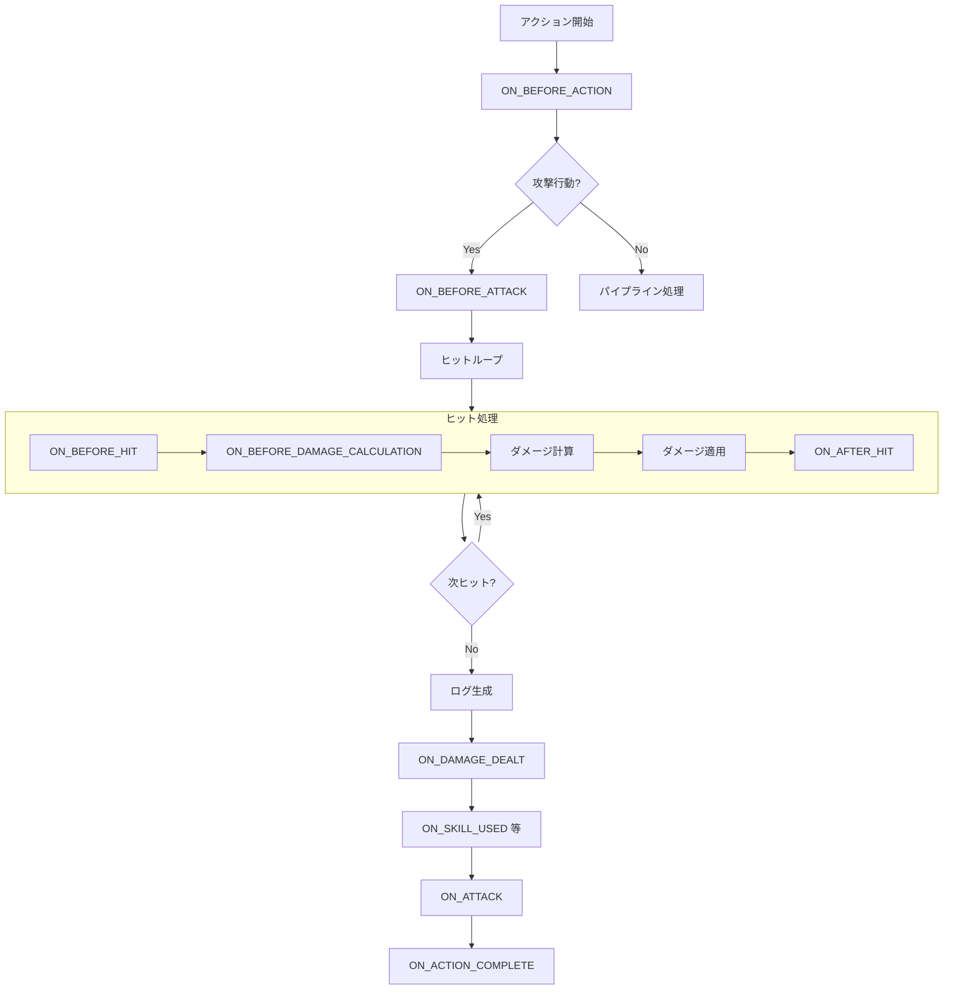

# イベントシステムリファレンス

このドキュメントでは、Honkai: Star Rail Simulatorにおけるイベントシステム、アクションパイプライン、ハンドラー実装方法について解説します。

---

## 概要

シミュレーターはイベント駆動型アーキテクチャを採用しています。アクション（攻撃、スキル等）や状態変化（ターン開始、ダメージ発生等）はすべて「イベント」として発行され、登録された「ハンドラー」がこれに反応して状態を更新します。

## イベントタイプ一覧

ハンドラーが購読できるイベントの一覧です。

### 基本イベント

| イベント | 発火タイミング | 取得できる情報 |
|----------|---------------|---------------|
| `ON_BATTLE_START` | 戦闘開始時 | `sourceId` |
| `ON_TURN_START` | ターン開始時 | `sourceId`（ターン所有者） |
| `ON_TURN_END` | ターン終了時 | `sourceId` |
| `ON_UNIT_HEALED` | 回復時 | `sourceId`, `targetId`, `value` |
| `ON_ENEMY_DEFEATED` | 敵撃破時 | `sourceId`, `targetId` |
| `ON_ENEMY_SPAWNED` | 敵生成時 | `sourceId` |
| `ON_UNIT_DEATH` | ユニット死亡/退場時 | `sourceId` |
| `ON_EP_GAINED` | EP回復時 | `sourceId`, `value` |
| `ON_SP_GAINED` | SP回復時 | `value` (回復量) |
| `ON_SP_CONSUMED` | SP消費時 | `value` (消費量) |

### アクション関連イベント

| イベント | 発火タイミング | 補足 |
|----------|---------------|------|
| `ON_BEFORE_ACTION` | すべての行動前 | 通常/スキル/必殺技/追撃すべて |
| `ON_BEFORE_ATTACK` | 攻撃行動前 | ダメージを伴う行動のみ |
| `ON_BASIC_ATTACK` | 通常攻撃後 | `isEnhanced`フラグで強化通常攻撃を判別 |
| `ON_ENHANCED_BASIC_ATTACK` | 強化通常攻撃後 | **非推奨**: `ON_BASIC_ATTACK` + `isEnhanced`を使用 |
| `ON_SKILL_USED` | スキル使用後 | |
| `ON_ULTIMATE_USED` | 必殺技使用後 | |
| `ON_FOLLOW_UP_ATTACK` | 追加攻撃後 | |
| `ON_ATTACK` | 全ての攻撃後 | |
| `ON_ACTION_COMPLETE` | アクション完了時 | 全処理終了後 |

### ダメージ/ヒット関連イベント

| イベント | 発火タイミング | 補足 |
|----------|---------------|------|
| `ON_BEFORE_HIT` | 各ヒットの計算前 | ヒットループ内先頭 |
| `ON_BEFORE_DAMAGE_CALCULATION` | ダメージ計算直前 | 防御無視などの動的介入口 |
| `ON_DAMAGE_DEALT` | ダメージ発生時 | リザルト適用後 |
| `ON_AFTER_HIT` | 各ヒットの計算後 | ヒットループ内末尾 |
| `ON_DOT_DAMAGE` | DoTダメージ発生時 | ターン開始時 |
| `ON_WEAKNESS_BREAK` | 弱点撃破時 | |
| `ON_WEAKNESS_BREAK_RECOVERY_ATTEMPT` | 撃破回復試行時 | 残梅などの遅延用 |

### エフェクト関連イベント

| イベント | 発火タイミング |
|----------|---------------|
| `ON_DEBUFF_APPLIED` | デバフ付与時 |
| `ON_EFFECT_APPLIED` | エフェクト付与時 |
| `ON_EFFECT_REMOVED` | エフェクト削除時 |

---

## ゲーム内説明文とイベントタイプの対応

光円錐やキャラクターの効果説明文から、どのイベントを使用すべきかを判断するためのリファレンスです。

### 攻撃関連

| 説明文 | イベントタイプ | 備考 |
|--------|---------------|------|
| 「攻撃を行った後」 | `ON_ATTACK` | 攻撃完了後に発動 |
| 「攻撃する時」「攻撃を行う時」 | `ON_BEFORE_ATTACK` | 攻撃開始前に発動 |
| 「ダメージを与えた時」 | `ON_DAMAGE_DEALT` | ダメージ適用後に発動 |
| 「通常攻撃を使用した後」 | `ON_BASIC_ATTACK` | 通常攻撃限定 |
| 「戦闘スキルを使用した後」 | `ON_SKILL_USED` | スキル限定 |
| 「必殺技を使用した後」 | `ON_ULTIMATE_USED` | 必殺技限定 |
| 「追加攻撃を行った後」 | `ON_FOLLOW_UP_ATTACK` | 追撃限定 |

### ヒット関連

| 説明文 | イベントタイプ | 備考 |
|--------|---------------|------|
| 「命中する時」「ヒット時」 | `ON_BEFORE_HIT` | 自身の攻撃がヒットする前 |
| 「命中を受けた時」「被弾時」 | `ON_BEFORE_HIT` | `event.targetId === unitId` で判定 |
| 「会心が発生した時」 | `ON_AFTER_HIT` | ヒット後に `isCrit` を確認 |

### ターン関連

| 説明文 | イベントタイプ | 備考 |
|--------|---------------|------|
| 「ターン開始時」 | `ON_TURN_START` | `event.sourceId === unitId` で自分のターンか判定 |
| 「ターン終了時」 | `ON_TURN_END` | |
| 「戦闘開始時」 | `ON_BATTLE_START` | |

### 状態変化関連

| 説明文 | イベントタイプ | 備考 |
|--------|---------------|------|
| 「回復を受けた時」 | `ON_UNIT_HEALED` | |
| 「EP回復時」 | `ON_EP_GAINED` | |
| 「敵を倒した時」 | `ON_ENEMY_DEFEATED` | |
| 「弱点撃破した時」 | `ON_WEAKNESS_BREAK` | |
| 「デバフを付与した時」 | `ON_DEBUFF_APPLIED` | |

### ターゲットタイプ判定

アクションイベントには `targetType` プロパティが含まれており、ターゲットの種類を判定できます。

#### 利用可能なヘルパー関数

```typescript
import { isSingleAllyTargetAction, isSingleEnemyTargetAction } from '@/app/simulator/engine/eventHelpers';
import { ActionEvent } from '@/app/simulator/engine/types';

// 単体味方ターゲット判定（targetType === 'ally' && targetIdあり）
if (isSingleAllyTargetAction(event as ActionEvent)) {
    // 味方単体に発動するスキル/必殺技のみ
}

// 単体敵ターゲット判定
if (isSingleEnemyTargetAction(event as ActionEvent)) {
    // 敵単体に発動するスキル/必殺技のみ
}
```

#### targetTypeの値

| targetType | 説明 |
|:-----------|:-----|
| `ally` | 味方単体 |
| `all_allies` | 味方全体 |
| `self` | 自己 |
| `single_enemy` | 敵単体 |
| `all_enemies` | 敵全体 |
| `blast` | 拡散 |
| `bounce` | バウンス |

### 自身 vs 他者の判定

イベント発火時に「自分自身」か「他者」かを判定する方法：

```typescript
// 自分が攻撃者（ソース）の場合
if (event.sourceId === unitId) { ... }

// 自分が対象（ターゲット）の場合
if (event.targetId === unitId) { ... }

// 例: 「命中を受けた時」（被弾時）
if (event.type === 'ON_BEFORE_HIT' && event.targetId === unitId) {
    // 自分が攻撃を受ける直前の処理
}
```

## アクションパイプラインと発火順序

アクション（「攻撃」を例とします）が実行される際のイベント発火フローです。



### 詳細フロー

1. **`ON_BEFORE_ACTION`**: アクションタイプに関わらず最初のエントリポイント。
2. **`ON_BEFORE_ATTACK`**: `BASIC_ATTACK`, `SKILL` (攻撃系), `ULTIMATE` (攻撃系), `FOLLOW_UP_ATTACK` の場合のみ。
3. **ヒットループ**:
    - **`ON_BEFORE_HIT`**: これから計算するヒットのインデックス等の情報。
    - **`ON_BEFORE_DAMAGE_CALCULATION`**: ここで `state.damageModifiers` を変更してダメージ計算に介入可能（例: ルアン・メェイE2の条件付きバフ）。
    - **ダメージ計算**: 実際にダメージ値を算出。
    - **`ON_AFTER_HIT`**: 計算結果（ダメージ、会心有無、撃破判定など）を受け取る。
4. **アクション後**:
    - **`ON_DAMAGE_DEALT`**: 合計ダメージ等の情報。
    - **固有イベント**: `ON_SKILL_USED` など。
    - **`ON_ATTACK`**: 攻撃アクション共通の終了イベント。
    - **`ON_ACTION_COMPLETE`**: すべて完了。

---

## ハンドラー実装パターン

### 基本ファクトリ構造

```typescript
import { IEventHandlerFactory, GameState, IEvent, Unit } from '../../simulator/engine/types';
import { createUnitId } from '../../simulator/engine/unitId';

export const characterNameHandlerFactory: IEventHandlerFactory = (
    sourceUnitId,
    level: number,
    eidolonLevel: number = 0
) => {
    return {
        handlerMetadata: {
            id: `character-name-handler-${sourceUnitId}`,
            subscribesTo: [
                'ON_BATTLE_START',
                'ON_TURN_START',
                'ON_SKILL_USED',
                // 必要なイベントを列挙
            ],
        },
        handlerLogic: (event: IEvent, state: GameState, handlerId: string): GameState => {
            // ソースユニットの存在確認
            const unit = state.registry.get(createUnitId(sourceUnitId));
            if (!unit) return state;

            // イベントタイプで分岐
            if (event.type === 'ON_BATTLE_START') {
                return onBattleStart(event, state, sourceUnitId, eidolonLevel);
            }
            // ...
            
            return state;
        }
    };
};
```

### 条件付きバフ（ON_BEFORE_DAMAGE_CALCULATION）

特定の条件（例：弱点撃破済みの敵への攻撃）でのみ発動する効果の実装例。

```typescript
// 1. 購読リストに追加
subscribesTo: ['ON_BEFORE_DAMAGE_CALCULATION'],

// 2. ロジック実装
if (event.type === 'ON_BEFORE_DAMAGE_CALCULATION' && event.sourceId === sourceUnitId) {
    // ターゲット情報の取得
    const target = state.registry.get(createUnitId(event.targetId!));
    
    // 条件: 敵が弱点撃破状態であること
    if (target && target.toughness <= 0) {
        // 現在のmodifiersを取得し、新しいmodifierを追加
        // 注意: damageModifiersは各ヒット単位でリセットされるため、加算処理が必要
        const currentIgnore = state.damageModifiers.defIgnore || 0;
        
        return {
            ...state,
            damageModifiers: {
                ...state.damageModifiers,
                defIgnore: currentIgnore + 0.20 // 防御無視+20%
            }
        };
    }
}
```

### クリティカル発生時の追加効果（ON_AFTER_HIT）

```typescript
// 1. 購読リストに追加
subscribesTo: ['ON_AFTER_HIT'],

// 2. ロジック実装
if (event.type === 'ON_AFTER_HIT' && event.sourceId === sourceUnitId) {
    // イベントペイロードから会心情報を取得（型キャストが必要な場合あり）
    const isCrit = (event as any).isCrit;
    
    if (isCrit) {
        // 追加ダメージやバフ付与などの処理
        // 注意: ヒットごとに呼ばれるため、1アクションで複数回発動する可能性がある点に注意
    }
}
```
